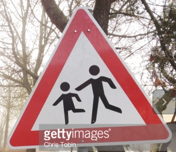
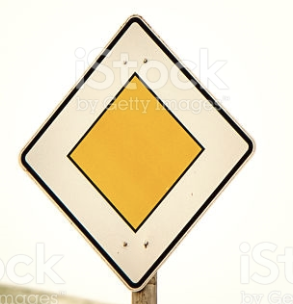
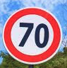
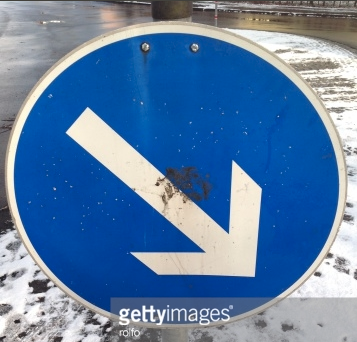
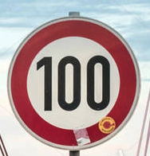

#**Traffic Sign Recognition** 

---

**Build a Traffic Sign Recognition Project**

The goals / steps of this project are the following:
* Load the data set (see below for links to the project data set)
* Explore, summarize and visualize the data set
* Design, train and test a model architecture
* Use the model to make predictions on new images
* Analyze the softmax probabilities of the new images
* Summarize the results with a written report


[//]: # "Image References"

[image1]: ./demo_images/train_set_distribution.png "origin_train_set"
[image2]: ./demo_images/validation_set_distribution.png "origin_validation_set"
[image3]: ./demo_images/test_set_distribution.png "origin_test_set"
[image4]: ./demo_images/image_before_any_manipulate.png "RGB_image"
[image5]: ./demo_images/image_after_grayscale_and_histogram_equalize.png "GrayScale"
[image6]: ./demo_images/before_vertically_filp.png "before flip"
[image7]: ./demo_images/after_vertically_filp.png "after flip"
[image8]: ./examples/placeholder.png "Traffic Sign 5"

## Rubric Points
###Here I will consider the [rubric points](https://review.udacity.com/#!/rubrics/481/view) individually and describe how I addressed each point in my implementation.  

---
###Writeup / README

####1. Provide a Writeup / README that includes all the rubric points and how you addressed each one. You can submit your writeup as markdown or pdf. You can use this template as a guide for writing the report. The submission includes the project code.

You're reading it! and here is a link to my [project code](https://github.com/fevemania/Traffic-Sign-Classifier/blob/master/Traffic_Sign_Classifier.ipynb)

---

###Data Set Summary & Exploration

+ ####The basic summary of the data set. 
  I used the build-in function **len()** and numpy **shape** to calculate summary statistics of the traffic
  signs data set:  
  - The size of training set is **34799**.
  - The size of the validation set is **4410**.
  - The size of test set is **12630**.
  - The shape of a traffic sign image is **(32, 32, 3)**.
  - The number of unique classes/labels in the data set is **43**.

+ ####Include an exploratory visualization of the dataset.

Here is an exploratory visualization of the data set. 

It is a bar chart showing that the dataset is **imbalance**.

![train data distribution][image1] ![valid data distribution][image2] ![test data distribution][image3]


Also, by plotting the 10 random images from each class, we know that the images **differ significantly in terms of contrast and brightness**. This is bad for deep learning to generalize with respect to the same class.


![yo][image4]

---

### Pre-process the Data Set

Because of such an imbalanced data, the great accuracy may skew in favor of few classes, and the result turned out to be a lie. However, it's almost impossible to make the dataset balance. The normal method to tackle imbalance is to get more data.

> According to ["8 Tactics to Combat Imbalanced Classes in Your Machine Learning Dataset"](http://machinelearningmastery.com/tactics-to-combat-imbalanced-classes-in-your-machine-learning-dataset/), the article in the blog of  Dr. Jason Brownlee. 

> It's a good idea to **get more data** to **reduce the affect of imbalance**.


But before doing augmentation like flipping, rotating, shifting, it would be better to tackle brightness problem first.


+ ####  Tackle Brightness Problem

From the paper writed by [Pierre Sermanet and Yann LeCun](http://yann.lecun.com/exdb/publis/pdf/sermanet-ijcnn-11.pdf), It tackle contrast problem by converting image from RGB to YUV colorspace. 

Also the article implicitly reveal that the result about using grayscale images to classify bacically eqauls to RGB images or even greater than that.

From [this post](https://read01.com/0MOGzg.html). I got the idea that the importance of YUV colorspace is 
that it can seperate luminance signal (Y) and chrominance signal (U, V). So, if we only take Y component, the image equivalently convert to grayscale, and fortunately that's what Opencv function cv2.RGB2GRAY() exactly does for us.

The grayscale images are then preprocessed with global or local contrast normalization.

> From Wiki of YUV, 

> + Y = 0.299 * R + 0.587 * G + 0.114 * B      (This is what cv2.RGB2GRAY() exactly do)
> + U = 0.492 * (B - Y)
> + V = 0.877 * (R - Y)


The result of pre-processing: (The plotting style is inspired by [Alex Staravoitau](https://navoshta.com/traffic-signs-classification/]))

![grayscale][image5]


+ ####  Data Augmentation

  - ##### Flipping (This part is inspired by [Alex Staravoitau](https://navoshta.com/traffic-signs-classification/]))

    There are three kinds of flipping: horizontally flip, vertically flip, horizontally and vertically flip.

    What flip does is through any of three methods to change the image background but not to effect the label of the image at the same time. For instance, we could do vertically flip on class 1, Speed limit (30 km/h), ![before flip][image6], the result of flipping: ![before flip][image7].

  - ##### Rotating and Shifting

    After flipping, the train dataset augment from **34799** to **59788**. Then I use ImageDataGenerator in Keras library, the high-level deep learning library, to make image rotate between [-2, 2] degrees, shift along width with[-3.2, 3.2] pixels, and shift along height with [-3.2, 3.2] pixels.

  ​

  The final size of new train dataset is **119568**.

+ #### Data Normalization

  Last but not the least, we must do data normalization to guarantee stable convergence of weight and biases. The method I have tried as follow:

  - Method 1. (all pixels - min value in all pixels) / (max value in all pixels - min value in all pixels)
  - Method 2. (all pixels - 128) / 128

  The first method makes range between [0, 1], and the second one makes range between [-1, 1].

  It seem that there maks no different result between two methods. So I finally chose the second one which have computational efficiency over the first one.

---


###Design and Test a Model Architecture


+ ####Describe what your final model architecture looks like including model type, layers, layer sizes, connectivity, etc.) Consider including a diagram and/or table describing the final model.

My final model consisted of the following layers: (**Note.** This model is multi-scale)

This model is inspired by [Alex Staravoitau](https://navoshta.com/traffic-signs-classification/])

|        Layer        |               Description                |
| :-----------------: | :--------------------------------------: |
|        Input        |         32x32x1 Grayscale image          |
|   Convolution 3x3   | 1x1 stride, same padding, outputs 32x32x32 |
|        RELU         |                                          |
|     Max pooling     |      2x2 stride,  outputs 16x16x32       |
|       Dropout       |         dropout 10% of the conv1         |
|                     |                                          |
|   Convolution 3x3   | 1x1 stride, same padding, outputs 16x16x64 |
|        RELU         |                                          |
|     Max pooling     |       2x2 stride,  outputs 8x8x64        |
|       Dropout       |         dropout 20% of the conv2         |
|                     |                                          |
|   Convolution 3x3   | 1x1 stride, same padding, outputs 8x8x128 |
|        RELU         |                                          |
|     Max pooling     |       2x2 stride,  outputs 4x4x128       |
|       Dropout       |         dropout 20% of the conv3         |
|                     |                                          |
| **Fully connected** | This layer is the multi-scale one. It is composed of three scales.                                              fc1 = scale from conv1 + scale from conv2 + scale from conv3,                                       inputs 3584, outputs 1024 |
|                     | scale from conv1: max pool with 4x4 stride from conv1, outputs 512 (4x4x32) |
|                     | scale from conv2: max pool with 2x2 stride from conv1, outputs 1024 (4x4x64) |
|                     | scale from conv3: max pool with 2x2 stride from conv1, outputs  2048 (4x4x128) |
|        RELU         |                                          |
|       Dropout       |          dropout 50% of the fc1          |
|                     |                                          |
|   fully connected   |                outputs 43                |
|       Softmax       |                                          |

+ ####Describe how you trained your model. The discussion can include the type of optimizer, the batch size, number of epochs and any hyperparameters such as learning rate.

```python
# initial parameter
EPOCHS = 100   # In reality, the training would never reach this value, it would rather 				 early stoping around 40

BATCH_SIZE = 64  # By trying serveral times, it is 64 that makes fastest convergence and most precise.

rate = 0.001 # To make the converge more faster, I use the high initial learning rate = 				0.001 And check if the valid error stop decreasing per epoch, 
			 # if yes, multiply rate by 0.1
```

To train this model, I use AdamOptimizer with learning rate 0.001. Here is two technique to prevent from overfitting. One is dropout, and the other is early stopping. 

A validation set can be used to assess how well the model is performing. A low accuracy on the training and validation sets imply underfitting. A high accuracy on the training set but low accuracy on the validation set implies overfitting.

For dropout, I set dropout on both convolutional and fully connect layer. With lots of test and error, slight dropout in convolutional layer helps to reach better accuracy.

For early stopping, my stop criterion is to save the weighted combination wich makes highest valid accuracy and lowest valid error during training. If the following 20 epochs couldn't update the last record, then stop training.


+ ####Describe the approach taken for finding a solution and getting the validation set accuracy to be at least 0.93. Include in the discussion the results on the training, validation and test sets and where in the code these were calculated. Your approach may have been an iterative process, in which case, outline the steps you took to get to the final solution and why you chose those steps. Perhaps your solution involved an already well known implementation or architecture. In this case, discuss why you think the architecture is suitable for the current problem.

  ​

My final model results were:
* training set accuracy of **100%**

* validation set accuracy of **98.9%** (early stopping keeps the highest validation accuracy during training, in the ipython notebook is at EPOCH 23.)

* test set accuracy of **97.5%**

  ​

An iterative approach was chosen:
* Q: What was the first architecture that was tried and why was it chosen?

  A: When I first introduce the Lenet model with no change in architecture, it reach 85-89% in validation set with  100% training accuracy, which means overfitting.

* Q: What were some problems with the initial architecture?

  A: I thought that the initial model didn't take any action to prevent from overfitting. Also cause it is the model fit for digit classification, which is too simple, or too small to fit for traffic sign classification.

  ​

* Q: How was the architecture adjusted and why was it adjusted? 

  A: As you can see, I use 3 convolutional layer with all 3x3 fliter and 2 fully connected layer.

  ​    I have tried filter size with (16, 32, 64), (32, 64, 128), (64, 128, 256), it seems (32, 64, 128) makes most precise, that is to say, the best fit to our dataset.

  ​    Reading from a few paper online,  I got the idea that small filter could reduce the degree of information losing in convolutional layour. Especially, our input data is (32, 32, 1), which is really small with few information in pixels, so I thought small filter is preferable.

  ​    For each convolution layer, it comes with the max pool layer to reduce the amount of parameter to train.

  ​    I chose RELU to be the activation function, rather than sigmoid to prevent from the typical vanish gradient descent problem.

  ​    To prevent from overfitting, I introduce dropout on both convolutional and fully connect layer. 

  I mainly give a huge dropout on fully-connectedly. Also, with lots of test and error, I found that slight dropout in convolutional layer helps to reach better accuracy. 

  ​    

* Which parameters were tuned? How were they adjusted and why?

  - For each convolutional layer, I tuned two parameter, one is filter size, and the other is padding value.

    The reason why I didn't change strides is that I thought (32, 32, 1) is small, and need not to increate the stride value which would make information loss. The filter size is tried and error to find the best fit on dataset. The padding value is also tried and error, and I found that there is no difference between 'valid' and 'same', so I chose 'same'.

  - For the first fully connected layer, I tried with single-scale and multi-scale layer, and it seems multi-scale getting a little improvement on validation accuracy.

  - For the second fully connected layer, I tried output value with 256, 512, and 1024, the accuracy is better with 1024 neurons.

---

###Test a Model on New Images

####1. Choose Six German traffic signs found on the web and provide them in the report. For each image, discuss what quality or qualities might be difficult to classify.

Here are six German traffic signs that I found on the web:


First, 								   Second,							  Third

   


Fourth,										 Fifth,

  

Sixth,

 

The first, second, fourth, and sixth images might be difficult to classify because there are some noisy on the sign, either the real stains or the artificial marks. And the third and fifth are both easy to classify.

####2. Discuss the model's predictions on these new traffic signs and compare the results to predicting on the test set. At a minimum, discuss what the predictions were, the accuracy on these new predictions, and compare the accuracy to the accuracy on the test set (OPTIONAL: Discuss the results in more detail as described in the "Stand Out Suggestions" part of the rubric).

Here are the results of the prediction:

|         Image         |      Prediction       |
| :-------------------: | :-------------------: |
|   Children crossing   |   Children crossing   |
|     Priority road     |     Priority road     |
| Speed limit (70km/h)  | Speed limit (70km/h)  |
|      Keep right       |      Keep right       |
|       Road work       |       Road work       |
| Speed limit (100km/h) | Speed limit (100km/h) |

The model was able to correctly guess 6 of the 6 traffic signs, which gives an accuracy of 100%.

The accuracy of Children crossing on test dataset is **98.0%** over 90 samples.

The accuracy of Priority road on test dataset is **97.39%** over 690 samples.

The accuracy of Speed limit (70km/h) on test dataset is **97.27%** over 660 samples.

The accuracy of Keep right on test dataset is **97.39%** over 690 samples.

The accuracy of Road work on test dataset is **97.08%** over 480 samples.

The accuracy of Speed limit (100km/h) on test dataset is **96.89%** over 450 samples.

####3. Describe how certain the model is when predicting on each of the six new images by looking at the softmax probabilities for each prediction. Provide the top 5 softmax probabilities for each image along with the sign type of each probability. (OPTIONAL: as described in the "Stand Out Suggestions" part of the rubric, visualizations can also be provided such as bar charts)

For the first image, the model is really sure that this is a Children crossing (probability of 1.0). The top five soft max probabilities were

| Probability | Class |          Prediction          |
| :---------: | :---: | :--------------------------: |
|     1.      |  28   |      Children crossing       |
|  5.944e-12  |  23   |        Slippery road         |
|  2.494e-12  |  24   |  Road narrows on the right   |
|  7.386e-12  |  20   | Dangerous curve to the right |
|  2.485e-13  |  27   |         Pedestrians          |


It makes sense because all of top 5 have triangle border.


For the second image, the model is really sure that this is a Priority road (probability of 1.0). The top five soft max probabilities were

| Probability | Class |      Prediction      |
| :---------: | :---: | :------------------: |
|     1.      |  12   |    Priority road     |
|     0.      |   0   | Speed limit (20km/h) |
|     0.      |   1   | Speed limit (30km/h) |
|     0.      |   2   | Speed limit (50km/h) |
|     0.      |   3   | Speed limit (60km/h) |

The shape of Priority road is so special that only the first one has probability value.


For the third image, the model is really sure that this is a Speed limit (70km/h) (probability of 1.0). The top five soft max probabilities were

| Probability | Class |      Prediction      |
| :---------: | :---: | :------------------: |
|     1.      |   4   | Speed limit (70km/h) |
|  8.302e-19  |   1   | Speed limit (30km/h) |
|  7.254e-24  |   0   | Speed limit (20km/h) |
|  8.539e-29  |   5   | Speed limit (80km/h) |
|  3.090e-29  |  18   |   General caution    |

It makes sense because all of top 4 have circle border.


For the fourth image, the model is really sure that this is a Keep right (probability of 1.0). The top five soft max probabilities were

|  Probability   | Class |      Prediction      |
| :------------: | :---: | :------------------: |
|       1.       |  38   |      Keep right      |
| 1.48032855e-25 |  40   | Roundabout mandatory |
| 2.02926495e-27 |  12   |    Priority road     |
| 2.24526526e-28 |  34   |   Turn left ahead    |
| 8.10440047e-30 |  15   |     No vehicles      |


For the fifth image, the model is really sure that this is a Road work (probability of 0.99). The top five soft max probabilities were

|  Probability   | Class |        Prediction         |
| :------------: | :---: | :-----------------------: |
|  0.999999881   |  25   |         Road work         |
| 1.21939152e-07 |  28   |     Children crossing     |
| 2.84793321e-13 |  29   |     Bicycles crossing     |
| 4.80072493e-16 |  22   | Road narrows on the right |
| 4.77129424e-16 |  30   |    Beware of ice/snow     |

It makes sense because all of top 5 have triangle border.


For the sixth image, the model is really sure that this is a Speed limit (100km/h) (probability of 0.99). The top five soft max probabilities were

|  Probability   | Class |      Prediction       |
| :------------: | :---: | :-------------------: |
|  0.999999881   |   7   | Speed limit (100km/h) |
| 1.52368727e-07 |   1   | Speed limit (30km/h)  |
| 1.92210514e-08 |   5   |  Speed limit (80km/h  |
| 2.45424236e-10 |   8   | Speed limit (120km/h) |
| 4.30159693e-11 |   4   | Speed limit (70km/h)  |

It makes sense because all of top 5 have circle border.